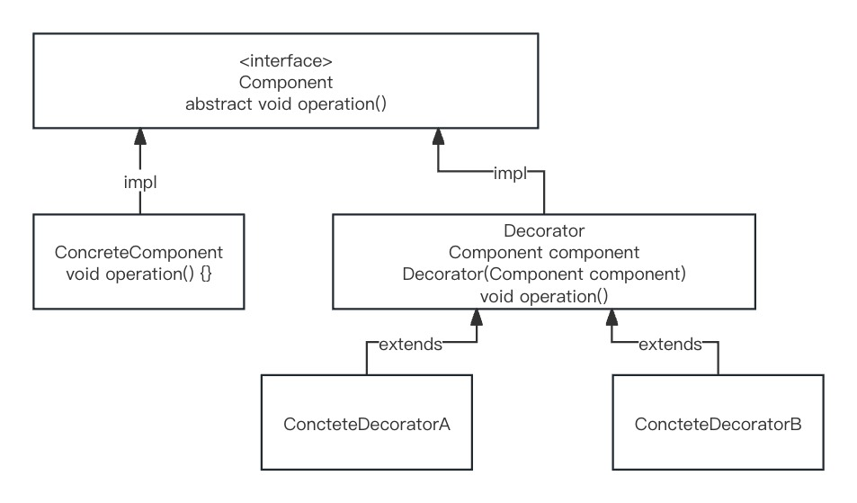

### 问：什么是装饰模式？

> 官方式答：在不改变现有对象结构的情况下，动态地给该对象增加一些额外职责（功能）的模式。
>
> 我答：人靠衣装，佛靠金装。这句谚语中的“衣”和“金”分别就装饰了“人”和“佛”；“衣”装饰了“人”，使人更加帅气逼人；“金”装饰了“佛”，使佛更加庄严肃穆。

### 装饰模式中的角色

- **抽象构件(Component)**：给出一个抽象接口，以规范准备接收附加责任的对象。不可实例化，定义抽象化接口，可以是interface也可以是抽象类。
- **具体构件(Concrete Component)**：定义一个将要接收附加责任的类。 抽象构件Component的具体实现，可实例化使用未被增强前的方法，也可以通过装饰角色为其添加一些职责（增强）。
- **抽象装饰（Decorator）**：继承或实现抽象构件，聚合抽象构件，通过子类扩展具体构件的功能。
- **具体装饰（Concrete Decorator）**：继承或实现抽象装饰的相关方法，扩展具体构件的职责（增强）。 继承Decorator抽象装饰类并进行扩展（增强）。

### java代码实现

类图如下：



1. 抽象构件

   ```java
   /**
    * 抽象构件角色：给出一个抽象接口，以规范准备接收附加责任的对象。 <br>
    * 不可实例化，定义抽象化接口，可以是interface也可以是抽象类。
    *
    * @author chen
    * @date 2024年03月01日 11:18
    */
   public interface Component {
   
       void operation();
   }
   ```

2. 具体构件

   ```java
   /**
    * 具体构件角色：定义一个将要接收附加责任的类。 <br/>
    * 抽象构件{@link Component}的具体实现，可实例化使用未被增强前的方法，也可以通过装饰角色为其添加一些职责（增强）。
    *
    * @author chen
    * @date 2024年03月01日 11:19
    */
   public class ConcreteComponent implements Component {
       @Override
       public void operation() {
           System.out.println("具体业务逻辑");
       }
   }
   ```

3. 抽象装饰

   ```java
   /**
    * 抽象装饰角色：继承或实现抽象构件，聚合抽象构件，通过子类扩展具体构件的功能。 <br/>
    * 实现抽象构件{@link  Component} <br>
    *
    * @author chen
    * @date 2024年03月01日 11:23
    */
   public abstract class Decorator implements Component {
   
       Component component;
   
       public Decorator(Component component) {
           this.component = component;
       }
   
       @Override
       public void operation() {
           //委派给构件
           component.operation();
       }
   }
   ```

4. 具体装饰

   ```java
   /**
    * 具体装饰角色：继承或实现抽象装饰的相关方法，扩展具体构件的职责（增强）。<br/>
    * 继承{@link Decorator}抽象装饰类并进行扩展（增强）。
    *
    *
    * @author chen
    * @date 2024年03月01日 11:27
    */
   public class ConcreteDecoratorA extends Decorator {
   
       public ConcreteDecoratorA(Component component) {
           super(component);
       }
   
       @Override
       public void operation() {
           super.operation();
           System.out.println("逻辑增强A");
           // 业务逻辑
       }
   
   
   }
   ```

测试：

```java
/**
 * @author chen
 * @date 2024年03月01日 11:14
 */
public class Main {

    public static void main(String[] args) {
        //没有经过修饰，直接使用具体构件
        /*ConcreteComponent concreteComponent = new ConcreteComponent();
        concreteComponent.operation();*/
        Component component = new ConcreteComponent();
        Component decoratorA = new ConcreteDecoratorA(component);
        decoratorA.operation();
      	//输出
      	/**
      		具体业务逻辑
					逻辑增强A
				**/
    }

}
```

